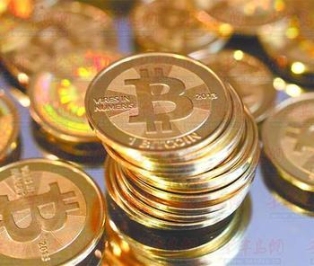

# 不得不说的比特币

{style=poem}
~~~~~~
没有根基也许可以建一座小屋但绝对不能造一座坚固的大厦。 
                    -- Eng.Isidor Goldreich

一切秘密都在密钥之中。
                    -- 匿名  
~~~~~~

在国家金融体系之外，大型企业及社区等民间集体的广义"货币"也遍地开花，虚拟币，游戏币，会员卡等层出不穷，由于电子货币实际上只是一条条有意义的记录，简单快捷低成本，几乎所有的此类货币都以电子货币的形式发行（国家也不允许民间发行纸币）。

他们在各自的领域内发挥了积极的作用，但也仅限于它们各自的领域内流通：

 - 它们只能购买特定的商品，一般为非实物商品。一首歌，一本电子书，或者游戏中的道具等。可谓专币专用。
 - 货币使用价值为发行方信用担保，在其领域内流通有效，外界并不认可。游戏玩家会认为游戏币可以买顶级装备有较高的价值，但对不玩游戏的大多数人来说游戏币没有意义。
 - 货币本身一般无价值，只是一些数字或者一张卡片，也无法保证不会被超发。
 - 国家对货币的严格管理，企业没有意愿也不能发行通用货币。

上述所有特性决定它们不可能成为一般意义上的货币，它们只能偏安一隅，像一粒粒沙子看着国家法定货币这个高楼大厦。
    
直到一个叫中本聪（Satoshi Nakamoto，可能是化名）的人出现。

2008年11月1日，一个自称中本聪的人在一个隐秘的密码学讨论组上贴出了一篇研究报告，报告阐述了他(她)对电子货币的新构想，比特币就此问世。2009年1月3日，中本聪开创了比特币P2P开源用户群节点和散列函数系统，从此，其对等网络和它的第一个区块链开始运行，他发行了有史以来的50个比特币。一年后，在比特币论坛上，用户群自发交易中，产生了第一个比特币公允汇率。该交易是一名用户发送10,000比特币，购买了一个披萨饼。随后比特币开始在全球快速发展。

## 比特币是什么
如前所述，比特币是一种用开源的P2P软件技术产生的电子货币，也是根据该开源软件以及建构其上的整个 P2P 网络的总称。

与大多数现行货币不同的是，比特币货币系统是独立存在的，其运行不依赖于中央银行、政府、大型企业的支持或者信用担保。比特币使用遍布整个P2P网络节点的分布式数据库来管理货币的发行、交易和账户余额信息。比特币采用密码学的原理，确保各个比特币节点按照既定的协议达成共识，从而确保货币流通各个环节的安全性。例如，比特币只能被它的真实拥有者使用，而且仅仅能使用一次，支付完成之后原主人即失去对该份额比特币的所有权。

比特币货币总量按照设计预定的速率逐步增加，增加速度逐步放缓，并最终在 2140 年达到2100 万个的极限。P2P的分布式特性与去中心化的设计结构，确保了理论上任何机构都不可能操控比特币的货币总量，或者制造通货膨胀。在全球范围内，比特币可以通过多个线上的交易所和服务商进行兑换交易，也可以在线下找到兑换点，兑换为现钞或金币。

> **中本聪身份之谜**

> 当人们对比特币津津乐道时，比特党也在试图揭开中本聪的神秘身份。讨论组的老手们从未听说过中本聪这个人，有关他(她)的信息也寥寥无几，还都隐晦不明甚至自相矛盾。网上简介显示他(她)在日本居住，但他(她)的电子邮箱地址却是来自德国的一个免费服务站点，谷歌上也没有他(她)的任何信息，显然，“中本聪”是个假名。

> 在一个比特币聊天频道里，有人自负地认为“Satoshi”在日语中是“智慧”的意思，其他人则怀疑这是4家科技公司名字的“拼盘”三星(Samsung)、东芝(Toshiba)、中道(Nakamichi)和摩托罗拉(Motorola)。甚至连他(她)的国籍也受到质疑，因为他(她)的英语太地道了，简直毫无瑕疵。

> 有人暗示，或许中本聪不是一个人，他(她)代表一个有着未知目的的神秘组织谷歌的一个团队或是国家安全局。豪涅茨说：“我和这家伙通过几封电邮。”豪涅茨有一段时间是比特币核心开发成员。“我总认为他不是真实存在的人，我大概每两周收一次回信，就像有人偶尔检查邮箱一样。比特币的设计非常棒，不像是靠一个人就能完成的。”

> 中本聪很少透露自己的信息，他(她)在网上谈论的话题只限于源代码技术讨论。2010年12月5日，在比特币使用者开始要求维基解密接受比特币捐赠后，原本言谈简洁只聊业务的中本聪以前所未有的热情参与到讨中。“不，不要这样做。”他(她)在比特币论坛里发帖说，“这个项目需要逐步成长，这样软件才能在这个过程中不断增强。我呼吁维基解密不要接受比特币，它还是一个萌芽阶段的小型测试社区。在这个阶段，如果不能妥善处理，只会毁了比特币。”

> 在此之后，就像他(她)的神秘出现一样，神龙见首不见尾的中本聪又消失了。格林威治时间2010年12月12日6点22分，就在他(她)发帖争辩给维基解密捐赠比特币7天后，中本聪在论坛发了最后一个帖子，帖中谈到软件最新版本几个无关紧要的细节，他(她)的电邮回复也变得更加不稳定，最后完全终止了。比特党对他(她)的离开感到悲伤和不解。但不管怎样，他(她)的发明已焕发出勃勃生机。

## 比特币大事记
2011年6月，在维基解密创始人阿桑奇和谷歌总裁Eric Schmidt 秘密会晤时，阿桑奇向他介绍并解释了“无国度”的比特币。维基解密、自由网、 Singularity Institute、互联网档案馆、自由软件基金会以及其他的一些组织，开始接受比特币的捐赠。一些小型的企业也开始接受比特币，LaCie公司是一间上市公司，接受比特币作为其Wuala服务的付款方式。

2012年10月，BitPay发布报告说，超过1000家商户通过他们的支付系统来接收比特币的付款。

2012年11月，WordPress宣布接受比特币付款。声明说肯尼亚、海地和古巴等地区遭受国际支付系统的封锁，比特币可以帮助这一地区的互联网用户购买服务。

2013年3月，美国财政部金融犯罪执法系统FinCEN发布了虚拟货币个人管理《条例》。

2013年4月，海盗湾, EZTV,开始接受比特币捐款。中国四川省雅安地震后，公募基金壹基金宣布接受比特币作为地震捐款。

2013年5月，电子前哨基金会宣布，在研究美国财政部金融犯罪执法系统发布的虚拟货币个人管理《条例》后，把比特币和汽车一样，当作礼物重新接受捐赠。

8月8日，比特币被美国德州联邦法官Hirsh裁为合法货币，受《联邦证券法》监管。

8月19日，德国政府认可了比特币的法律和税收地位，成为全球第一个正式认可比特币合法身份的国家
 
10月29日，全球第一部比特币自动提款机于加拿大温哥华激活，但交易额限额每天3000加元。

11月20日美国司法部和美国证交会的代表在北京时间周一晚间出席美国参议院的一个听证会时称，比特币是一种合法的金融工具，这一说法预计将会推进比特币合法化的进程。据听证会上公布的文件，美联储主席伯南克认为，比特币“或具有长期的承诺”，也能够某一天“促进更快速、更安全和更高效的支付体系”。目前还没有必要对虚拟货币进行直接干预和监管。

11月20日，中国人民银行副行长易纲在一场论坛上表示，从人民银行角度，近期不可能承认比特币的合法性。但他同时认为，比特币交易作为一种互联网上的买卖行为，普通民众拥有参与的自由。此外，易纲还指出比特币“很有特点”，具有“启发性”，个人会保持长期关注。 [^bitcoin_big_things]

[^bitcoin_big_things]: 维基百科 比特币发展史

比特币散发出无穷的魅力，这个诞生在互联网上的新生事物，似乎天生就没有国界，迅速在世界范围流行起来。

## 大洋对岸的比特币故事

> **Rockxie的致富路**

> Rockxie的家乡位于湖南省和江西省的交界处，由于家境贫寒，小时候家里常常连学费都缴不起，但是Rockxie读书很用功，并以优异的成绩考上了合肥工业大学计算机系。钻研于计算机领域的Rockxie从2006年大三开始，在起点中文网上连载第一部网络小说《黑客传说》，小说以“计算机”、“黑客”为主要元素，融入了推理和玄幻的风格，在网上广受好评，累计点击量超过400万，而Rockxie也由此挖到了第一桶金。

> 他将这数万元稿费全部用来补贴家用，自己投身于第二部小说《超级系统》的创作。毕业后，Rockxie在上海一家软件公司从事软件开发。但是习惯了自己支配时间、自由撰写网络小说的他，对朝九晚五的生活很不适应。不多久，他就离开了公司，专心投身于写作。期间，他还和朋友合伙创业，主要从事传统工业电器方面的销售，不过由于市场、管理，以及个人兴趣等方面的原因，三年之后他最终还是选择退出。

> 故事发展到这里好像也没什么大不了，就在他准备撰写新小说《超脑黑客》时，“比特币”这个神秘的概念，跃入了他的视野。当时比特币交易所遭到黑客袭击，价格从29美元跌到了3美元左右，大家都很消沉，纷纷探讨比特币的泡沫，也有一些人想寻找下家，抛售手中的比特币。而Rockxie在论坛里泡久了，对这种新型的电子货币渐渐产生了兴趣。一开始他并没有想到投资，只是想把这个元素融入小说，于是广泛地收集一些比特币的资料，其中包括许多国外的技术性文章。通过不断地学习，他发现比特币的泡沫并没有想象中那么大，而当时他创业项目不太景气，在股票市场也频频受挫，于是开始购入比特币投资。第一次购买比特币是通过淘宝网的卖家，大约40元人民币一个，其中还包括几元手续费。随后比特币价格慢慢回升，Rockxie也越买越多，并开始登录专业的交易网站，他陆陆续续购买了1000个，平均成本约60多元，共动用了六七万元资金。

> 就在Rockxie不断购买比特币的同时，他从一位比特币圈内的朋友处得到消息，一家名为“bitfountain” (烤猫)的公司正在比特币社区中面向全世界发起众筹项目。烤猫公司虽然在国内名不见经传，但是在比特币世界里却赫赫有名，它是比特币世界中最大的矿机供应商之一(挖矿机是一种软件，可通过连续计算产生比特币)，当时谋求在互联网虚拟IPO上市。虚拟IPO是和现实资本市场平行的世界。在这个世界中，人们可以通过特定的交易系统，用比特币买卖公司的股票，上市公司会根据每年的业绩情况，以比特币的形式，给股东分红。”在烤猫公司上市之前，其原始股为0.1比特币一股，买5000股以上可以额外赠送10%股，Rockxie将其1000个比特币全部买入了烤猫股份，共持有11000股。随着比特币热度持续上升，烤猫公司成功地虚拟上市，其股价从0.1比特币上升到目前的5比特币，Rockxie的资产又翻了50倍。经过几次减持后，Rockxie目前仍然持有公司超过5000股的股份，并持有6000多枚比特币，总市值超过千万人民币。

就这样，Rockxie成了像其书中主角《超脑黑客》主人公那样传奇一般的人物。当被问及面对一个新生事物，他怎么会有勇气一次下这么大注码时，Rockxie答道：起初我和很多人一样，也认为比特币是泡沫，所以只是想把它作为一个素材写进小说。但正是因为写作的缘故，我才对比特币进行了深入研究。我是读计算机的，随着对比特币算法、体系的了解程度越深，我对它的信任度越强，所以才敢于做这样的投资。当比特币被越来越多的人认同，使用范围越来越广时，它的价格会不断上升。在国外，已经有很多支持比特币支付的商店和旅馆；在国内，也有很多淘宝卖家支持比特币，不论外界评论怎样，比特币仍然会沿着自己的轨道发展。 [^rich_story]

[^rich_story]: IT时报  网络作家上演比特币投资神话

Q> ## 小思考
Q> 为什么大洋西岸产生的一个新兴事物短短时间即能在大洋东岸催生一个个千万富翁？

目前，比特币最为主要的参考汇率是Mtgox交易所内比特币与美元的成交汇率。2013年11月，比特币的交易价格创下1242美元的历史新高，同期黄金价格为每盎司1241.98美元，比特币价格首次超过黄金。短短两年时间，比特币的价格涨了成千上万倍。它为什么有如此大的魅力？

## 比特币原理

中本聪在其论文[^bitcoin_paper]中对比特币网络的原理有详细的描述。该论文论述严谨，涉及大量数学，密码学及计算机知识，质量很高，也让常人难以理解。理解有助于信任和使用，这里尝试用浅显的语言对该论文做一个通俗易懂的解读。

[^bitcoin_paper]: 比特币论文 http://bitcoin.org/bitcoin.pdf

我们可以把比特币理解为很复杂的方程组的有限个（约2100万）解，每一个解都能解开方程并且是唯一的。如果把它想象成人民币的序列号，每个比特币就相对于一张人民币。挖矿的过程就是通过庞大的计算量不断的去寻求这个方程组解的过程。由于这个方程组被设计成了只有2100万个解，所以比特币的上限就是 2100 万。

那如何把钱花出去呢，编号为1的比特币的持有人都知道有这么一个比特币，那它不是可以永远使用它？
答案是不行。比特币网络是一个在线系统，比特币本身作为一串数（方程组的解）离开了比特币网络一点用处也没有，这些数只有放进比特币网络里才能正常运作。

比特币网络被设计成了一种分布式系统，我们可以把它想象为一个账本，它上面记满了各类明细。这个账本并不存在某个中心的服务器里而是面向所有人公开，每一个比特币钱包都是一个节点。这些节点用类似于 BT 下载的 P2P 网络相连。

I> ## 小知识
I> 比特币钱包记录着全世界所有人的数据,现在的数据大约为7G，如果以后钱包继续增大可以抛弃一些陈I> 旧且无意义的交易细节。

怎么能保证比特币在同一时刻只会拥有一个合法的主人呢？答案来了，每当你发起一次交易的时候，都会向整个比特币网发出广播，内容如下：

> “我是钱包 A，有编号为 123 的比特币，现在要转账给钱包 B，请你们更新你们的账本”
比特币网络里的其他钱包收到这个信息纷纷与自己的账本比对，并回应：
“我带入方程算了下，编号为 123 的比特币存在。我看到了钱包 A 和 B 也存在，且该123号比特币确实为 A 所有，我承认这笔交易并将修改我的账本。”

当确认的节点数达到一定量的时候（取决于收款方想要有多稳妥），交易就成功发生了。
接下来，越来越多的节点收到了这个消息，并且没有人提出异议，这个交易记录就被整个比特币网络所接受，从此比特 123 成为了 B 钱包里的所有物。

如果你在交易结束之后，欺骗本地客户端，又让 A 钱包发出信息：

> “我是钱包 A，有比特币 123，现在要转账给钱包 C，请你们更新你们的账本”（和之前一样的过程）。
其他节点收到信息与本地数据库一对比：
“不对，我这写着比特币 123 在 B 手里，不承认交易。”

 
越来越多的节点拒绝了交易，于是你的交易就失败了。
挖矿也是同样的原理，利用大量的计算力去计算方程组特解，而你的矿机程序会先与本地的账本进行对比，发现自己这里从来没有这个特解，于是向全网广播：

> “我是 A，我这有个新比特币，叫 234，你们要没见过我可就收下了？”
 
之后的原理与交易就相同了。你可能注意到，交易的成功需要有大多数节点接受才能成功，也就是说，只要系统中诚实的节点数量多余欺诈的节点数量，整个系统就是安全的。比特币网络的这种容错机制，可以保证即便是有一定的欺诈者（一直发布虚假信息）和捣乱者（一直拒绝承认别人的交易）也不会影响到整个网络的运转。

## 优势与不足

**去中心化**
比特币是第一个真正意义上的分布式的虚拟货币，整个网络由用户构成，没有中央银行。去中心化是比特币安全与自由的保证。

**全世界流通**
比特币可以在任意一台接入互联网的电脑上管理。不管身处何方，任何人都可以挖掘、购买、出售或收取比特币。

**专属所有权**
操控你的比特币需要你的私钥，它可以被隔离保存在任何存储介质。除了你之外无人可以获取。

**低交易费用**
目前可以免费汇出比特币，但最终对每笔交易将收取约1比特分的交易费以确保交易更快执行。关于交易费的详情。

**无隐藏成本**
作为由A到B的支付手段，比特币没有繁琐的额度与手续限制。知道对方比特币地址就可以进行支付。

**很酷的技术**
比特币是技术人士的挚爱！你可以在众多平台上发掘不同硬件的计算能力。这本身已构成一种乐趣。

比特币是第一个被公众广泛接触和认可的电子货币，作为电子货币大军的排头兵，它冲在了最前面也出尽了风头。但它也有不足和风险。

**隐私和安全**
由于比特币的方便易用及没有监管，一些违法犯罪分子选择比特币作为脏款转移工具；所有的比特币交易都公开且永久地存储在网络中，这就意味着任何人都可以查看到任何一个比特币地址中的余额和交易记录。

**资源浪费**
其次随着比特币渐渐流行，越来越多的人投身到挖矿的行列中，很多计算资源和电力消耗在挖矿行为中，这看上去像浪费。比特币的交易确认时间较长，一般需要10分钟，所以如果对时效性有较高要求，比特币不适用。

**仍需兑换**
比特币无法超发，作为一种货币为人们提供了很大的信心，但它无法解决和其它货币的协作问题。短时间内产生一种世界货币的可能性很小，多币种共存的现象将继续下去，所以货币对抗及货币兑换问题也依然存在。

**比特币仍有实验性**
比特币是一个正处于积极发展中的实验性新货币。尽管它的实验性正随着它不断增长的使用率而在逐渐减小，但是要记住比特币是一个全新的发明，它正探索以往从未被尝试过的理念，因此，没有人可以预测比特币的未来。

**政府的态度**
比特币还不是正式的货币,政府对其的态度也将极大影响其发展。